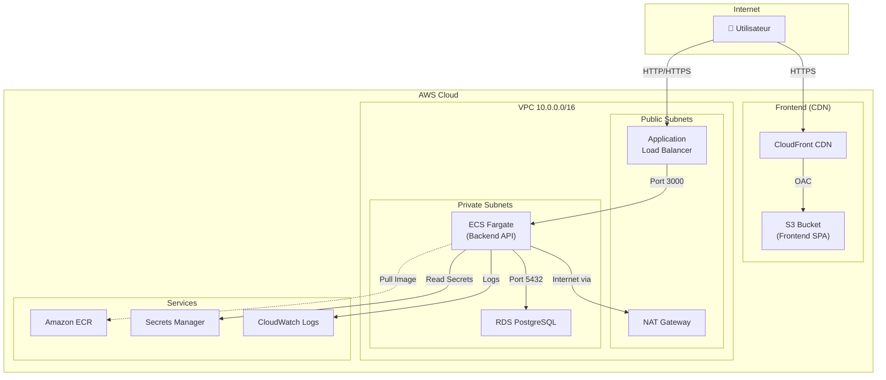
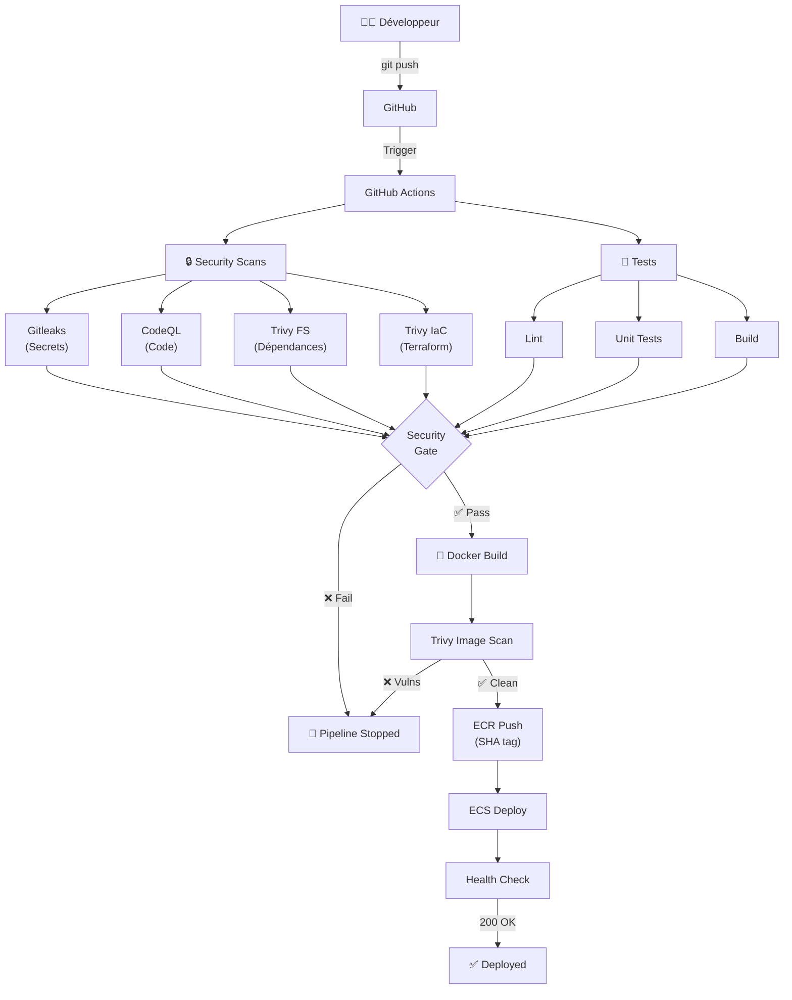
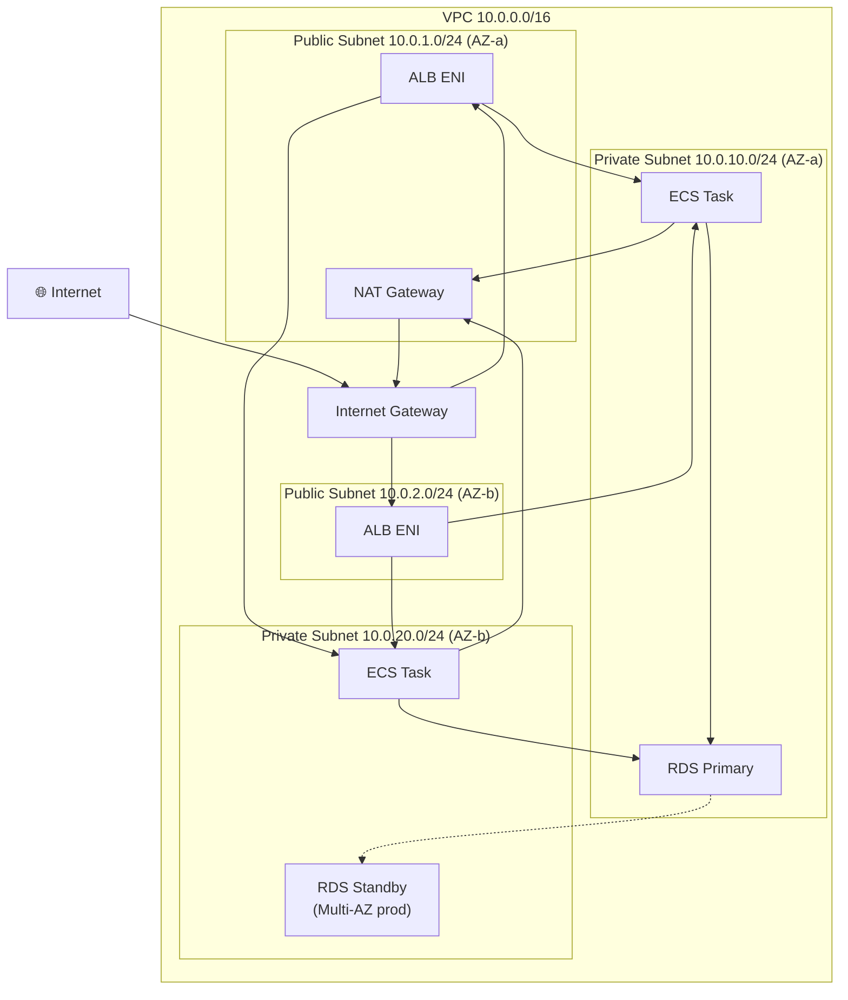
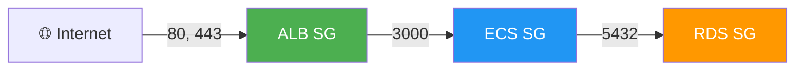
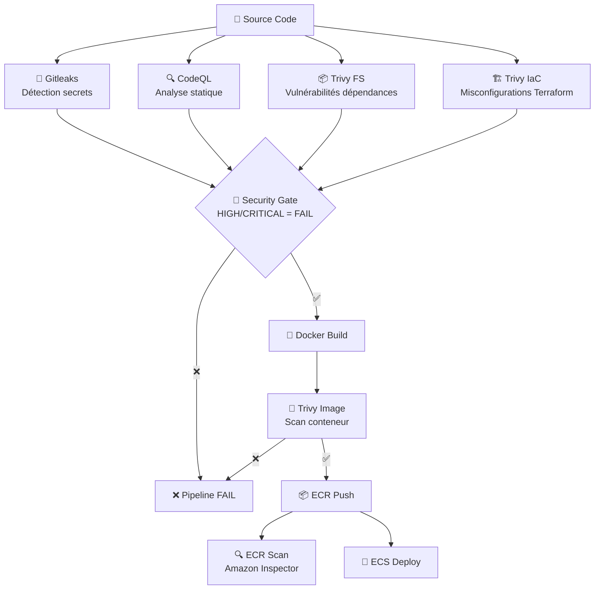
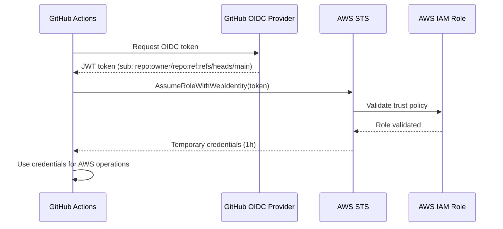

# Architecture Diagrams

## Architecture Globale

```mermaid
flowchart TD
    subgraph Internet
        User["👤 Utilisateur"]
    end

    subgraph AWS Cloud
        subgraph "Frontend (CDN)"
            CF["CloudFront CDN"]
            S3["S3 Bucket<br/>(Frontend SPA)"]
        end

        subgraph "VPC 10.0.0.0/16"
            subgraph "Public Subnets"
                ALB["Application<br/>Load Balancer"]
                NAT["NAT Gateway"]
            end

            subgraph "Private Subnets"
                ECS["ECS Fargate<br/>(Backend API)"]
                RDS["RDS PostgreSQL"]
            end
        end

        subgraph "Services"
            ECR["Amazon ECR"]
            SM["Secrets Manager"]
            CW["CloudWatch Logs"]
        end
    end

    User -->|HTTPS| CF
    CF -->|OAC| S3
    User -->|HTTP/HTTPS| ALB
    ALB -->|Port 3000| ECS
    ECS -->|Port 5432| RDS
    ECS -->|Read Secrets| SM
    ECS -->|Logs| CW
    ECS -.->|Pull Image| ECR
    ECS -->|Internet via| NAT
```

## Pipeline CI/CD

```mermaid
flowchart TD
    Dev["👨‍💻 Développeur"] -->|git push| GH["GitHub"]

    GH -->|Trigger| GA["GitHub Actions"]

    GA --> SEC["🔒 Security Scans"]
    GA --> TEST["🧪 Tests"]

    SEC --> GL["Gitleaks<br/>(Secrets)"]
    SEC --> CQL["CodeQL<br/>(Code)"]
    SEC --> TFS["Trivy FS<br/>(Dépendances)"]
    SEC --> TIC["Trivy IaC<br/>(Terraform)"]

    GL & CQL & TFS & TIC --> GATE{"Security<br/>Gate"}

    TEST --> LINT["Lint"]
    TEST --> UT["Unit Tests"]
    TEST --> BLD["Build"]

    LINT & UT & BLD --> GATE

    GATE -->|✅ Pass| DOCKER["🐳 Docker Build"]
    GATE -->|❌ Fail| STOP["🛑 Pipeline Stopped"]

    DOCKER --> TRIVY["Trivy Image Scan"]
    TRIVY -->|✅ Clean| PUSH["ECR Push<br/>(SHA tag)"]
    TRIVY -->|❌ Vulns| STOP

    PUSH --> DEPLOY["ECS Deploy"]
    DEPLOY --> HEALTH["Health Check"]
    HEALTH -->|200 OK| SUCCESS["✅ Deployed"]
```

## Architecture Réseau

```mermaid
flowchart TD
    subgraph "VPC 10.0.0.0/16"
        subgraph "Public Subnet 10.0.1.0/24 (AZ-a)"
            ALB1["ALB ENI"]
            NAT1["NAT Gateway"]
        end

        subgraph "Public Subnet 10.0.2.0/24 (AZ-b)"
            ALB2["ALB ENI"]
        end

        subgraph "Private Subnet 10.0.10.0/24 (AZ-a)"
            ECS1["ECS Task"]
            RDS1["RDS Primary"]
        end

        subgraph "Private Subnet 10.0.20.0/24 (AZ-b)"
            ECS2["ECS Task"]
            RDS2["RDS Standby<br/>(Multi-AZ prod)"]
        end

        IGW["Internet Gateway"]
    end

    Internet["🌐 Internet"] --> IGW
    IGW --> ALB1 & ALB2
    ALB1 & ALB2 --> ECS1 & ECS2
    ECS1 & ECS2 --> RDS1
    ECS1 & ECS2 --> NAT1
    NAT1 --> IGW
    RDS1 -.-> RDS2
```

## Security Groups

```mermaid
flowchart LR
    Internet["🌐 Internet"] -->|80, 443| ALB_SG["ALB SG"]
    ALB_SG -->|3000| ECS_SG["ECS SG"]
    ECS_SG -->|5432| RDS_SG["RDS SG"]

    style ALB_SG fill:#4CAF50,color:#fff
    style ECS_SG fill:#2196F3,color:#fff
    style RDS_SG fill:#FF9800,color:#fff
```

## Pipeline de Sécurité

```mermaid
flowchart TD
    SRC["📁 Source Code"]

    SRC --> GL["🔑 Gitleaks<br/>Détection secrets"]
    SRC --> CQ["🔍 CodeQL<br/>Analyse statique"]
    SRC --> TF["📦 Trivy FS<br/>Vulnérabilités dépendances"]
    SRC --> TI["🏗️ Trivy IaC<br/>Misconfigurations Terraform"]

    GL & CQ & TF & TI --> SG{"🚧 Security Gate<br/>HIGH/CRITICAL = FAIL"}

    SG -->|✅| DB["🐳 Docker Build"]
    SG -->|❌| FAIL["❌ Pipeline FAIL"]

    DB --> TS["🔬 Trivy Image<br/>Scan conteneur"]
    TS -->|✅| ECR["📦 ECR Push"]
    TS -->|❌| FAIL

    ECR --> ES["🔍 ECR Scan<br/>Amazon Inspector"]
    ECR --> DEPLOY["🚀 ECS Deploy"]
```

## GitHub OIDC Authentication

```mermaid
sequenceDiagram
    participant GA as GitHub Actions
    participant OIDC as GitHub OIDC Provider
    participant STS as AWS STS
    participant IAM as AWS IAM Role

    GA->>OIDC: Request OIDC token
    OIDC-->>GA: JWT token (sub: repo:owner/repo:ref:refs/heads/main)
    GA->>STS: AssumeRoleWithWebIdentity(token)
    STS->>IAM: Validate trust policy
    IAM-->>STS: Role validated
    STS-->>GA: Temporary credentials (1h)
    GA->>GA: Use credentials for AWS operations
```
